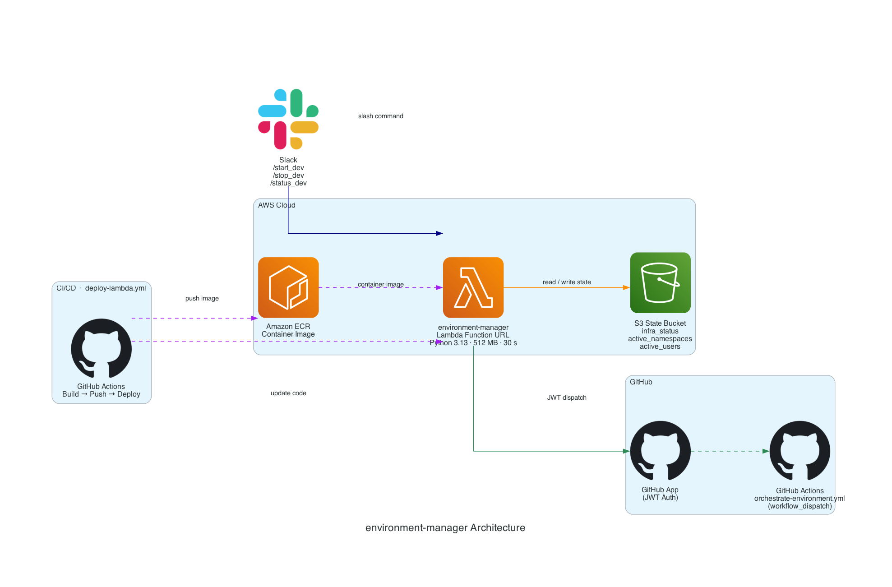

# environment-manager

Slack slash command 기반으로 `eks-security-infra` 환경의 시작/중지/상태 조회를 오케스트레이션하는 AWS Lambda 컨테이너 애플리케이션

## 지원 명령어

- `/hello`: 콜드 스타트 확인용으로 `hello, world`를 반환합니다.
- `/start_dev`: 호출자에게 매핑된 namespace를 포함해 `eks-secure-infra` orchestration workflow를 실행합니다.
- `/stop_dev`: 호출자를 활성 사용자 집합에서 제거하고, 마지막 사용자라면 `bootstrap`을 제외한 환경을 종료합니다.
- `/status_dev`: S3 상태 파일을 읽어 현재 infra 상태, 활성 namespace, 활성 사용자, 진행 중 작업, 마지막 오류를 보여줍니다.

## 아키텍처 

